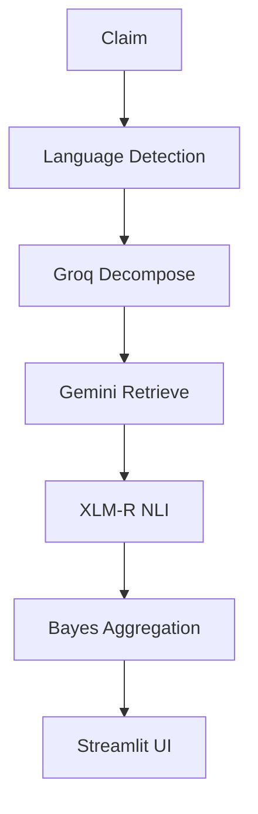

# Multilingual Misinformation Verifier

An end-to-end fact-checking pipeline designed to detect, decompose, verify, and explain claims across multiple languages. The system breaks complex statements into atomic sub-claims, retrieves grounded web citations, scores cross-lingual stance relations, and aggregates evidence into a calibrated veracity score.

## Architecture



## Tech Stack

- **Language Detection & NLI**: XLM-RoBERTa (`xlm-roberta-base`), `langdetect`
- **Claim Decomposition**: Groq Cloud (`llama-3.3-70b-versatile`) via LangChain
- **Grounded Evidence Retrieval**: Google Gemini with Google Search Grounding
- **Probabilistic Fusion**: Bayesian Likelihood Ratio Updating & Wilson Score Confidence Intervals
- **Web Interface**: Streamlit with interactive evidence exploration and stage latency diagnostics
- **Caching**: Persistent SQLite-backed disk cache

## Local Setup

### 1. Prerequisites
- Python 3.10+
- API Keys: Groq Cloud, Google Gemini, and Hugging Face

### 2. Environment Configuration
Create a `.env` file in the root directory:
```env
GROQ_API_KEY=your_groq_api_key_here
GEMINI_API_KEY=your_gemini_api_key_here
HF_TOKEN=your_huggingface_token_here
CACHE_DIR=cache/pipeline_cache.db
```

### 3. Install Dependencies
```bash
pip install -r requirements.txt
```

### 4. Run the Streamlit Dashboard
```bash
streamlit run app/main.py
```

### 5. Run Tests
```bash
pytest tests/
```

## Deployment

This application is configured for deployment on Hugging Face Spaces (Streamlit SDK, free CPU tier).
Configure `GROQ_API_KEY`, `GEMINI_API_KEY`, and `HF_TOKEN` in Hugging Face Spaces Repository Secrets (`Settings` > `Variables and secrets`).